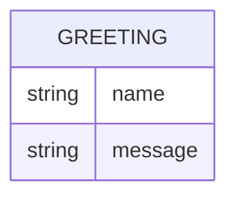

# Domain model

Greeter holds no persisted state; the one shape worth naming is the greeting
it hands back for a given name.

`Greeting` is never stored — it is computed fresh for each call from the
`name` query parameter and returned as the response body.